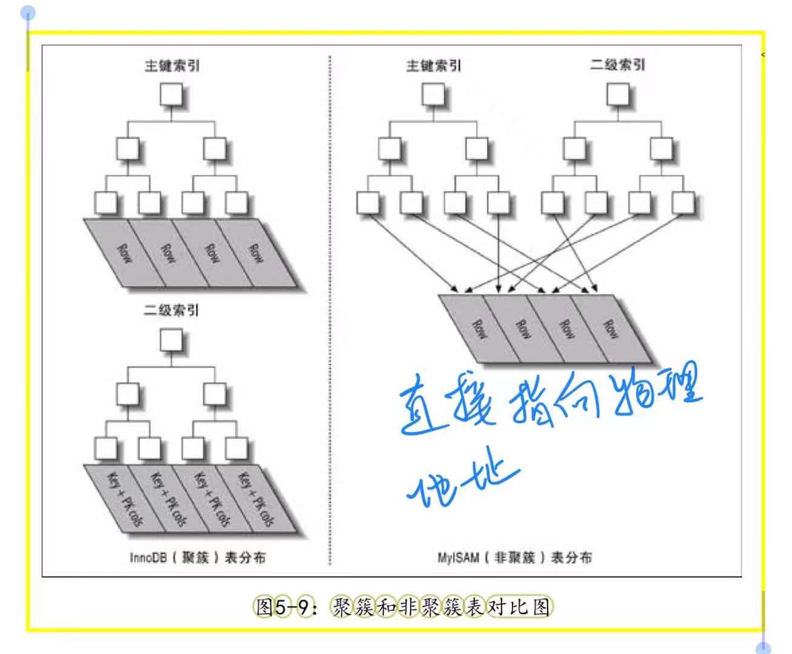
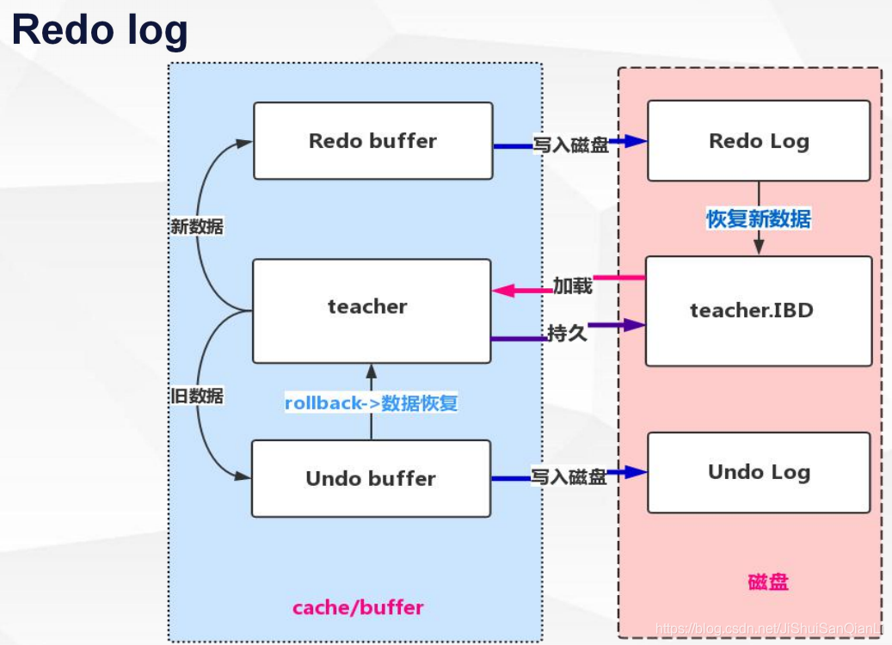

可以参考：https://blog.csdn.net/ThinkWon/article/details/104778621
# Mysql 常见面试题

## 事务
事务是指作为单个逻辑工作单元执行的一系列操作，要么全执行，要么全不执行，需要满足 ACID 特性。

### 原子性（ Atomic ）
事务被视为不可分割的最小单元，事务的所有操作要么成功，要么失败回滚，不会结束在中间某个环节。

### 一致性（ Consistent ）
在事务执行前后数据库的完整性没有被破坏。这表示写入的数据必须符合所有预设规则。

### 隔离性 （ Isolation ）
允许多个事务同时执行，一个事务的执行不会影响其他事务，事务之间是隔离的。事务隔离性分为不同级别，包括读未提交、读已提交、可重复读、串行化。

### 持久性 （ Duration ）
事务一旦提交，对数据的修改是永久的，即便系统故障也不会丢失。

### MySQL 支持事务吗
在缺省模式下，MySQL 是 autocommit 模式，所有的数据库更新操作都会即时提交，所以在缺省模式下 MySQL 不支持事务。
但是如果使用 InnoDB，就可以支持事务，只要 SET AUTOCOMMIT = 0，在非 autocommit 模式下，需要使用 COMMIT 来提交更改，或者使用 ROLLBACK 来回滚更改。

***

## 隔离级别
脏读：事务可以读到未提交的数据。（针对的是事务修改后回滚，那么在此之前读到的数据称之为脏数据）
不可重复读：一个事务从开始直到提交之前，所做的任何修改对其他事务都是不可见的。（针对事务执行过程中有修改，两次读到的数据可能不一致）
幻读：当一个事务读取某个范围内的数据时，另一个事务又在该范围内插入了新数据，当之前的事务再次读取该范围的记录时，会产生幻行。（针对范围记录，两次读取出现幻行）

### 读未提交（ Read Uncommitted ）
事务中的修改，即使没有提交，对其他事务都是可见的。

### 读已提交（ Read Committed ）
一个事务开始时，只能“看见”已经提交的事务所做的修改，解决了脏读的问题。（这是大多数数据库系统的默认隔离级别，但 Mysql 不是。）

### 可重复读（Repeated Read ）
保证了在同一个事务中多次读取同样记录结果的一致性，解决了脏读、不可重复读，但没有解决幻读。（这是 Mysql 的默认隔离级别，InnoDB 使用多版本并发控制 MVCC 机制解决了幻读的问题。）

### 可串行化（ Serializable ）
最高隔离级别，事务串行化执行，解决了幻读的问题。

****

## MVCC
MVCC 是多版本并发控制机制，通过保存数据在某个时间点的快照来实现，在每行记录后面保存两个隐藏列，分别保存这个行的创建版本号和删除版本号。MVCC 机制解决行级锁的大量开销，只有在写写时互相阻塞，使用版本控制达到读写不冲突、读不加锁、高并发。InnoDB 的 MVCC使用快照存储在 Undo 日志中，该日志通过回滚指针把一个数据行所有快照连接起来。

### InnoDB 的 MVCC 是如何实现的
MVCC 只在 RR 和 RC 隔离级别下工作
select、insert、delete、update 分类讨论：

SELECT：符合以下两点的记录才能作为查询返回结果。
1. InnoDB 只查找版本早于当前事务版本的数据行（也就是行的系统版本号小于或等于事务的系统版本号），这样可以确保事务读取的行，要么是在事务开始前已经存在的，要么是事务自身插入或者修改过的。
2. 行的删除版本要么未定义，要么大于当前事务版本号。这可以确保事务读取到的行，在事务开始之前未被删除。

INSERT：
InnoDB 为新插入的每一行保存当前系统版本号作为行版本号。

DELETE：
InnoDB 为删除的每一行保存当前系统版本号作为删除标识。

UPDATE：
InnoDB 为插入一行新记录，保存当前系统版本号作为行版本号，同时保存当前系统版本号到原来的行作为行删除标识。（额外空间）

### 快照读和当前读
- 快照读，当执行select的时候，innodb默认会执行快照读，相当于就是给你目前的状态找了一张照片，以后执行select 的时候就会返回当前照片里面的数据，当其他事务提交了也对你不造成影响，和你没关系，这就实现了可重复读了，那这个照片是什么时候生成的呢？不是开启事务的时候，是当你第一次执行select的时候，也就是说，当A开启了事务，然后没有执行任何操作，这时候B insert了一条数据然后commit,这时候A执行 select，那么返回的数据中就会有B添加的那条数据......之后无论再有其他事务commit都没有关系，因为照片已经生成了，而且不会再生成了，以后都会参考这张照片。（select）

- 当前读，读取的是记录数据的最新版本，并且当前读返回的记录都会加上锁，保证其他事务不会再并发的修改这条记录。update时，首先会执行当前读，然后把返回的数据加锁，之后执行update。加锁是防止别的事务在这个时候对这条记录做什么，默认加的是排他锁，也就是你读都不可以，这样就可以保证数据不会出错了。但注意一点，就算你这里加了写锁，别的事务也还是能访问的，是不是很奇怪？数据库采取了一致性非锁定读，别的事务会去读取一个快照数据。（update、insert、delete、select for update、select lock in share mod）

***

## 锁

### 什么是锁
数据库中存在多个用户并发得存取同一个数据、多个事务并发得存取同一个数据，若不对并发操作加以控制就可能产生读取和存储不正确的数据，破坏数据库的一致性。
加锁是实现数据库并发控制的一个非常重要的技术。当某一事务释放锁之前，其他事务不能对此数据进行更新操作。

### MySql 中有哪几种锁
- 表级锁：开销小，加锁快。
- 行级锁：开销大，加锁慢，会出现死锁。

- 共享锁：读锁。
- 排他锁：写锁。

### 死锁解决
1. 死锁检测，检测循环依赖关系，让某些事务回滚。
2. 死锁超时机制，超时事务回滚。

### 死锁检测算法
//TODO 死锁检测算法

### 如何避免死锁
1. 以固定的顺序访问表和行，最常见的就是数据预处理。
2. 大事务拆小。大事务更倾向于死锁，如果业务允许，将大事务拆小。
3. 在同一个事务中，尽可能做到一次锁定所需要的所有资源，减少死锁概率。
4. 降低隔离级别。比如将 RR 调整为 RC，可以避免掉很多因为 gap 锁造成的死锁。//TODO 举例 gap 锁造成的死锁
5. 为表添加合理的索引。

### 什么情况下 InnoDB 会使用行锁、表锁
//TODO 行锁表锁
InnoDB是基于索引来完成行锁
例: select * from tab_with_index where id = 1 for update;
for update 可以根据条件来完成行锁锁定,并且 id 是有索引键的列,
如果 id 不是索引键那么InnoDB将完成表锁,,并发将无从谈起

***

## InnoDB 数据页
数据页大小为 16K，被划分为多个部分，如图所示

其中
File Header 存储了页的一些通用信息（包括页号，下一页的地址等）
Page Header 存储数据页专有的信息（包括本页存储了多少条记录，第一条记录的地址，目录中存储了多少个槽等）
Page Dictionary 存储各个槽的编号，由于 InnoDB 的设计每个分组中的记录条数是有规定的：对于最小记录所在的分组只能有 1 条记录，最大记录所在的分组拥有的记录条数只能在 1~8 条之间，剩下的分组中记录的条数范围只能在是 4~8 条之间。因此目录的出现可以使原本的**链表结构可以支持二分查找**相应的数据。(感慨：这设计真牛逼啊)

***

## 索引
索引是 存储引擎 用于快速查找记录的一种数据结构。

### 索引的优缺点
优点：
1. 索引大大减少了服务器需要扫描的数据量。
2. 索引可以帮助服务器避免排序和临时表。
3. 索引可以将随机 I/O 变成顺序 I/O。（IO密集型: 系统运行，大部分的状况是CPU在等 I/O(硬盘/内存)的读/写。CPU密集型: 大部分时间用来做计算，逻辑判断等CPU动作的程序称之CPU密集型。 ）
缺点：
1. 创建和维护索引需要耗费时间，会降低增删改的效率，时间随数据量的增加而增加。
2. 索引需要占用物理空间。

### 索引类型
- 主键索引：数据列不允许重复，不允许为 NULL，一个表只能有一个主键。
- 唯一索引：数据列不允许重复，允许为 NULL，一个表允许多个列创建唯一索引。如 UNIQUE(column)、UNIQUE(column1, column2)
- 普通索引：没有唯一性限制，允许为 NULL，如 INDEX(column)
- 哈希索引：基于哈希表实现，。
- B-TREE索引
- 自适应哈希索引：当 InnoDB 注意到某些索引值被使用得非常频繁时，他会在内存中基于 B-TREE 索引之上再创建一个哈希索引，这是一个完全自动的内部行为，用户无法控制或配置。
- 全文索引：查找文本中的关键字，而不是直接比较索引中的值。如 FULLTEXT(column)

### 索引选择性
索引的选择性越高则查询效率越高，因为选择性高的索引可以让 MySQL 在查找时过滤掉更多的行。唯一索引的选择性是1，这是最好的索引选择性，性能也是最好的。

### 前缀索引的优缺点
- 前缀索引是一种能使索引更小、更快的有效办法。
- MySQL 无法使用前缀索引做 order by 和 group by。
- 无法使用前缀索引做覆盖扫描。

### B树与B+树的比较
B树、B+树的建树过程图：https://blog.csdn.net/a2311minghan/article/details/89705532
1. 最大的区别是 B+树只有叶子节点存储数据，其余节点用来存储索引。B+树更适合用来存储外部数据，也就是磁盘数据。
2. B+树是用来作为索引的，一般来说索引很大，需要存储在磁盘上，每次在查询索引的时候，都需要把索引读到内存中，B+树的索引比B树的小很多，可以有效减少 I/O 次数，查询效率更高。
3. B+树所有的Data域在叶子节点，一般来说都会进行一个优化，就是将所有的叶子节点用指针串起来，有利于范围查询，而范围查询其实是非常频繁的。

### B+树与哈希索引的比较
//TODO B+树与哈希索引的比较

### B+树与红黑树的比较
//TODO B+树与红黑树的比较

### 聚簇索引和非聚簇索引

InnoDB：
- 在同一个结构中保存了B-Tree索引和数据行，数据行存放于叶子结点。
- 通过主键聚集数据，如果没有定义主键，InnoDB 会选择唯一的非空索引代替，再没有，会隐式定义一个主键来作为聚簇索引。
- InnoDB 只聚集在同一个页面中的记录，包含相邻键值的页面可能会相距甚远。
- 二级索引叶子节点存储的是主键值。
- 二级索引访问行需要两次索引查找。
- 假如 ID 是主键，二级索引列 A 上的索引就相当于索引(A, ID)，这是索引覆盖。
- 缺点：二级索引可能比想象更大，因为二级索引的叶子节点包含了引用行的主键列。

MyISAM：
- MyISAM 按照数据插入的顺序存储在磁盘上。
- MyISAM 使用前缀压缩技术使索引更小。
- 无论是主键索引还是二级索引，其叶子节点存储的是行的物理地址。

### InnoDB 二级索引的叶子节点存储的不是“行指针”，而是主键值
这样的策略减少了当出现行移动或数据页分裂时二级索引的维护工作。使用主键值当做指针会让二级索引占用更多的空间，换来的好处是，InnoDB 在移动行时无须更新二级索引中的这个“指针”。

### 为什么聚簇索引通常建议使用自增id
使用自增id 作为主键，主键是顺序的，所以 InnoDB 把每一条记录都存储在上一条记录的后面，当达到页的最大填充因子时，下一条记录就会写入新的页。这种方式索引结构紧凑、磁盘碎片少，不会存在页分裂，大大提高性能。
如果不使用自增id，而是乱序得写入，InnoDB 不得不频繁得做页分裂操作，这将导致移动大量数据，页会变得稀疏，数据碎片得增加最后还会使得全表扫描变慢。

### MySQL 中 B+树一个节点大小是多大
一页，MySQL 的 InnoDB 引擎中一页的默认大小为16K。

### B+树一个节点存储多少元素合适？为什么是一页？
因为如果一个节点的大小小于1页，那么读取这个节点的时候其实也会读出1页，会造成资源的浪费；如果一个节点的大小大于1页，比如1.2页，那么读取这个节点的时候会读出2页，也会造成资源的浪费；所以为了不造成资源的浪费，最后把一个节点的大小控制在1页、2页、3页、4页等倍数页大小最为合适。

### 什么情况下设置了索引但无法使用
1. 以 % 开头的 LIKE 模糊匹配。
2. OR 语句前后没有同时使用索引。
3. 使用函数修饰的字段、或者字段在表达式中。
4. 数据类型出现隐式转化（如 varchar 不加单引号可能会自动转换为 int 型）//TODO 数据类型出现隐式转化不会使用索引

### 创建索引的原则
1. 使用最左前缀匹配。
2. 较频繁作为查询条件的字段才去创建索引。
3. 更新频繁字段不适合创建索引。（因为每次修改字段可能还得修改索引，有时还会造成页分裂。）
4. 选择性太低的列也不适合创建索引。如性别。
5. 尽量扩展索引，而不是新建索引。如已有索引a，现在需要索引(a, b)，拓展即可。
6. 对于定义为text、image、bit的数据类型的列不要建立索引。

### 百万级别或以上的数据如何删除
索引需要额外的维护成本，会降低增删改的执行效率，在百万级数据时，删除数据的速度和创建的索引数量成正比。
1. 可以先删除索引。
2. 再删除无用的数据
3. 删除完成后重建索引。

***

## 日志
//TODO 日志

### MySql 有哪几类日志
主要了解前 3 类即可。
1. 事务日志：分为 redo log（重做日志）、undo log（回滚日志）
2. 二进制日志：主要用来实现主从复制
3. 慢查询日志：记录查询比较慢的语句，便于 DBA 分析和性能优化。
4. 查询日志：记录所有查询操作

### 事务日志
目的是提高事务的效率。存储引擎在修改表的数据时只需修改其内存拷贝，再把该修改行为记录到持久在硬盘上的事务日志中，而不用每次都将修改的数据本身持久化到磁盘上。

事务日志主要是用来保障数据库的 ACID，尽可能降低宕机造成的内存数据丢失。使用 redo log 和 undo log 来保证。

- redo log
作用：确保事务的持久性，防止在发生故障的时间点，尚有脏页未写入磁盘。在 MySql 重启的时候，只需要重做 redo log 就可以达到事务数据的一致性。
文件：记录的是物理数据页面的修改情况。
生产：事务开始之后就产生 redo log，并不是随着事务的提交才写的。
释放：当对应事务的脏页写入磁盘后，redo log 占用的空间可以重用（被覆盖）。
实现：首先会将日志写入缓冲区 Innodb_log_buffer，然后再通过三种方式将缓存日志刷新到磁盘上：
1. Master Thread 每秒一次执行刷新到磁盘。
2. 每个事务提交时刷新到磁盘。
3. 当缓存可用空间少于一半时，刷新到磁盘。

- undo log
作用：保存事务开始之前的一个版本，可用用于回滚，实现事务的原子性。同时还可以提供多版本并发控制（MVCC）下的并发读，即读不加锁。
文件：逻辑格式的日志，在执行 undo 时，仅仅将数据从逻辑上恢复至事务开始之前状态，不会修改物理页。
生产：事务开始之前，产生当前版本的 undo log。
释放：当事务提交之后，undo log 并不会立即删除，而是放入待清理链表中，确保事务 undo 段之前版本信息没有被使用后才清理。
实现：与 redo log 类似。

### 二进制日志 binlog
由来：MySQL 为了兼容其他非事务引擎的复制，在 server 层引入了 binlog。
作用：binlog 主要用于主从复制、数据恢复
文件：二进制日志索引文件，用于记录所有有效的二进制文件。二进制日志文件，记录数据库 DDL 和 DML 语句事件。
产生：事务提交时。
释放：超过配置的时间后，自动删除。

binlog 日志格式：
1. statement，每一条会修改数据的 sql 及上下文相关信息都记录在 binlog 中。
2. row，不记录 sql 语句，只记录哪条记录被修改过。缺点是会产生大量的日志。
3. mixed，前两者的综合，一般的语句修改使用 statment 格式保存 binlog，如一些函数，statement 无法完成主从复制的操作，则采用 row 格式保存 binlog。

### 

### binlog 与 redo log 的区别
- 作用不同：redo log 保证事务的持久性，是事务层面的。binlog 是数据库层面的，恢复整个数据库的数据。
- 内容不同：redo log 是物理日志，是数据页面修改记录。binlog 是逻辑日志，绝大部分是 sql 语句。
- 恢复数据效率：redo log 效率一般高于 binlog。

***

## 分布式事务

### XA 是什么
XA 是一个接口，定义了（全局）事务管理器（TM：Transaction Manager）和（局部）资源管理器（RM：Resource Manager）之间的接口。

### 分布式事务如何实现
XA 为了实现分布式事务，将事务的提交分为两个阶段：
- prepare 阶段。
TM 向所有涉及到的 TM 发出 prepare 请求，数据库收到请求后执行数据修改和日志记录等处理，处理完成后把事务的状态修改为“可以提交”，然后返回结果给 TM。
- commit 阶段。
TM 收到回应后进入第二阶段。如果第一阶段有任何数据库的操作发生错误，或者事务管理器收不到某个数据库的回应，则认为事务失败，回撤所有数据库事务，数据库服务器收不到第二阶段的确认提交请求，也会把“可以提交”事务撤回。如果第一阶段中所有数据都成功，那么 TM 向 RM 发出“确认提交”请求，数据库服务器把事务的“可以提交状态”改为“提交完成”状态，然后返回应答。
- 外部与内部 XA
MySql 中的 XA 实现分为：外部 XA 和 内部 XA。前者指通常意义上的分布式事务实现，后者指单台 MySql 服务器中，Server 层作为 TM（通常由 binlog 模块担当），而服务器中的多个数据块实例作为 RM，而进行的一种分布式事务。内部 XA 可以用来保证 redo log 与 binlog 的一致性问题。

### 事务日志与二进制日志的一致性问题
MySQL 为了兼容其他非事务引擎的复制，在 server 层引入了 binlog。然而这种情况会导致 redo log 与 binlog 的一致性问题，MySQL 通过内部 XA 机制解决了这一问题：
- 第一阶段：InnoDB prepare，write/sync redo log，binlog 不作任何操作。
- 第二阶段：1.write/sync binlog、2.InnoDB commit（commit in memory）。

当第二阶段的第1步执行完成之后，binlog已经写入，MySQL会认为事务已经提交并持久化了(在这一步binlog就已经ready并且可以发送给订阅者了)。在这个时刻，就算数据库发生了崩溃，那么重启MySQL之后依然能正确恢复该事务。在这一步之前包含这一步任何操作的失败都会引起事务的rollback。

第二阶段的第2步大部分都是内存操作(注意这里的InnoDB commit不是事务的commit)，比如释放锁，释放mvcc相关的read view等等。MySQL认为这一步不会发生任何错误，一旦发生了错误那就是数据库的崩溃，MySQL自身无法处理。这个阶段没有任何导致事务rollback的逻辑。在程序运行层面，只有这一步完成之后，事务导致变更才能通过API或者客户端查询体现出来。

***

## MySql 数据结构相关

### CHAR 和 VARCHAR 的区别
1. CHAR 列长度固定为创建表时声明的长度，长度值范围是1到255，这里的长度对应的是字符数，还要根据使用的字符集来计算相应的存储空间（ascii 字符集，一个字符 1 字节；utf8 字符集，一个字符 1~3 字节）
2. 采用 Compact 行格式时，对于使用 utf8 字符集的 CHAR(10) 来说，该列存储的数据字节长度的范围是10～30个字节。即使我们向该列中存储一个空字符串也会占用10个字节，这是怕将来更新该列的值的字节长度大于原有值的字节长度而小于10个字节时，可以在该记录处直接更新，而不是在存储空间中重新分配一个新的记录空间，导致原有的记录空间成为所谓的碎片。
3. 当 CHAR 值被存储时，它们被用空格填充到特定长度，检索 CHAR 值时需要删除尾随空格。
4. 采用 Redundant 行格式，使用CHAR(M)类型，占用的真实数据空间就是该字符集表示一个字符最多需要的字节数和M的乘积。比方说使用utf8字符集的CHAR(10)类型的列占用的真实数据空间始终为30个字节。
5. VARCHAR 是可变长字符串

### VARCHAR(50) 中的50的涵义
最多存放50个字符，VARCHAR(50) 和 (200) 存储 hello 所占空间一样，但后者在排序时会消耗更多内存，因为 order by col 采用 fixed_length 计算 col 的长度。

### 行溢出
- Compact 行格式: 如果我们向一个行中存储了很大的数据时，可能发生行溢出的现象。在记录的真实数据处只会存储该列的一部分数据，把剩余的数据分散存储在几个其他的页中。
- Dynamic 行格式: MySQL5.7 的默认行格式就是 Dynamic，和Compact行格式挺像，只不过在处理行溢出数据时有点儿分歧，它们不会在记录的真实数据处存储字段真实数据的前768个字节，而是把所有的字节都存储到其他页面中，只在记录的真实数据处存储其他页面的地址。

### InnoDB 主键的生成策略
优先使用用户自定义主键作为主键，如果用户没有定义主键，则选取一个Unique键作为主键，如果表中连Unique键都没有定义的话，则InnoDB会为表默认添加一个名为row_id的隐藏列作为主键。

### 如果有一列被定义为TIMESTAMP，将发生什么
每当行被更改时，时间戳字段将获取当前时间戳。

### 列设置为 AUTO INCREMENT，如果在表中达到最大值，会发生什么
它会停止递增，任何进一步的插入都将产生错误。

### LIKE声明中的 % 和 _ 有什么区别
% 对应于0个或更多字符，而 _ 只匹配一个字符。

### 解释 MySQL 外连接、内连接、自然连接的区别
1. 自然连接，也称笛卡尔积，直接将两张表的所有记录一一匹配，形成n*m的大表。
2. 内连接，即有条件的自然连接，根据条件筛选出符合条件的记录，只连接匹配的行。
3. 外连接，其结果集中不仅包含符合连接条件的行，而且还包括左表、右表或两个表中所有的数据行，这三种情况依次称之为左外连接、右外连接、全外连接。
- 左外连接，也称左连接，左表为主表，左表中的所有记录都会出现在结果集中，对于那些在右表没有匹配的记录，仍要显示，右边对应的字段值以NULL来填充。

### 完整性约束
数据完整性是指数据的精确和可靠性，分为以下四类：
1. 实体完整性：规定表的每一行在表中是唯一的实体。
2. 域完整性：是指表中的列必须满足某种特定的数据类型约束，其中约束又包括取值范围、精度等。
3. 参照完整性：是指两个表的主关键字和外关键字的数据应一致（即外键），保证了表之间的数据一致性，防止数据丢失或无意义的数据在数据库中扩散。
4. 用户定义的完整性：用户定义的完整性即是针对某个特定关系数据库的约束条件，它反映某一具体应用必须满足的语义要求。

### 视图
什么是视图：

什么是游标：

视图的优点：

### 存储过程

***

## MySQL 优化相关

### MySQL 如何优化 DISTINCT
1. 如果没有索引，全表扫描，必然慢。
2. 存在索引，数据是排好顺序的，分析sql可以看到 using index for group-by

### SQL 注入漏洞产生的原因？如何防止？
SQL 注入产生的原因：
程序开发过程中不注意规范书写 sql 语句和对特殊字符进行过滤，导致客户端可以通过全局变量 POST 和 GET 提交一些 sql 语句正常执行。
//TODO sql 注入

### 如何保证表格里的字段值接受特定范围的值
- Check 限制，在数据库表格里被定义，用来限制输入该列的值，也可以在程序中 check。
- 触发器，可能会影响性能。

### 对 SQL 语句优化有哪些方法
//TODO SQL 语句优化

