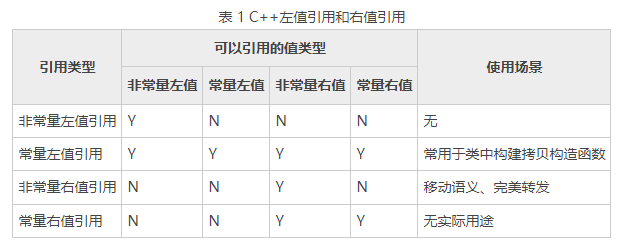

# C++11 新特性
http://c.biancheng.net/cplus/11/

## auto 类型推导
- auto 仅仅是一个占位符，在编译器期间它会被真正的类型所替代。
- auto 根据变量的初始值来推导出变量类型。

### auto 的限制
1. auto 不能在函数的参数中使用。
2. auto 不能作用于类的非静态成员变量（ 无 static ）
3. auto 不能定义数组
4. auto 不能作用于模板参数

### auto 的应用
1. 定义 stl 的迭代器（ auto it = v.begin() ）
2. 用于泛性编程，以下举例：
```c++
template <typename T>
void func(void){
    auto val = T::get(); //在 c++11 之前，需要再增加一个模板参数，每次调用的时候传递需要使用的类型。
    cout << val << endl;
}
```

## decltype 类型推导
decltype 是 “declare type” 的缩写，译为 “声明类型”。
decltype(exp) varname = value;
其中，varname 表示变量名，value 表示赋予变量的值，exp 表示一个表达式。

### decltype 和 auto 的区别
- auto 根据 = 右边的初始值 value 推导出变量类型，而 decltype 根据 exp 表达式推导出变量类型，跟 value 没有关系。
- auto 要求变量必须初始化，而 decltype 不要求。


## Lambda 匿名函数
[ 捕获 ] ( 形参 ) lambda说明符 约束(可选) -> 返回值类型 { 函数体 }

捕获：指当前 lambda 表达式可以捕获位于同一作用域内的所有局部变量，有值传递、引用传递。

形参：和普通函数一样，可接收外部传递的多个参数，也可以连()一起省略。

lambda说明符：可省略，可选的说明符有，mutable、constexpr、consteval。其中 mutable 允许函数体修改「复制捕获」的对象，以及调用它们的非 const 成员函数。
对于以值传递方式引入的外部变量，lambda 表达式修改的是拷贝的那一份，并不会修改真正的外部变量。

约束：可省略

-> : 指明返回值类型，可省略。如果函数体内有 return 或者 返回值为 void，则可以省略。

函数体：与普通函数一样

### lambda 表达式的应用
- 对数组排序时作为 cmp 函数使用
- 一些不需要反复用到的函数可以定义为 lambda 函数

### lambda 值传递、引用传递的区别
- 以下代码可以看到：
在创建 lambda1 和 lambda2 匿名函数的作用域中，有 num_1、num_2 和 num_3 这 3 个局部变量，另外还有 all_num 全局变量。
其中，lambda1 匿名函数是以 [=] 值传递的方式导入的局部变量，这意味着默认情况下，此函数内部无法修改这 3 个局部变量的值，但全局变量 all_num 除外。
相对地，lambda2 匿名函数以 [&] 引用传递的方式导入这 3 个局部变量，因此在该函数的内部不但可以访问这 3 个局部变量，还可以任意修改它们。同样，也可以访问甚至修改全局变量。

```c++
#include <iostream>
using namespace std;
//全局变量
int all_num = 0;
int main()
{
    //局部变量
    int num_1 = 1;
    int num_2 = 2;
    int num_3 = 3;
    cout << "lambda1:\n";
    auto lambda1 = [=]{
        //全局变量可以访问甚至修改
        all_num = 10;
        //函数体内只能使用外部变量，而无法对它们进行修改
        cout << num_1 << " "
             << num_2 << " "
             << num_3 << endl;
    };
    lambda1();
    cout << all_num <<endl;
    cout << "lambda2:\n";
    auto lambda2 = [&]{
        all_num = 100;
        num_1 = 10;
        num_2 = 20;
        num_3 = 30;
        cout << num_1 << " "
             << num_2 << " "
             << num_3 << endl;
    };
    lambda2();
    cout << all_num << endl;
    return 0;
}
```

****

## 智能指针

### 自己写的小demo
```C++
#include <iostream> 
#include <memory> 
template<typename T> 
class SmartPointer { 
private: 
    T* _ptr; 
    size_t* _count; 
public: 
    SmartPointer(T* ptr = nullptr) : 
            _ptr(ptr) { 
        if (_ptr) { 
            _count = new size_t(1); 
        } else { 
            _count = new size_t(0); 
        } 
    } 
    SmartPointer(const SmartPointer& ptr) { 
        if (this != &ptr) { 
            this->_ptr = ptr._ptr; 
            this->_count = ptr._count; 
            (*this->_count)++; 
        } 
    } 
    SmartPointer& operator=(const SmartPointer& ptr) { 
        if (this->_ptr == ptr._ptr) { 
            return *this; 
        } 
        if (this->_ptr) { 
            (*this->_count)--; 
            if (this->_count == 0) { 
                delete this->_ptr; 
                delete this->_count; 
            } 
        } 
        this->_ptr = ptr._ptr; 
        this->_count = ptr._count; 
        (*this->_count)++; 
        return *this; 
    } 
    T& operator*() { 
        assert(this->_ptr == nullptr); 
        return *(this->_ptr); 
    } 
    T* operator->() { 
        assert(this->_ptr == nullptr); 
        return this->_ptr; 
    } 
    ~SmartPointer() { 
        (*this->_count)--; 
        if (*this->_count == 0) { 
            delete this->_ptr; 
            delete this->_count; 
        } 
    } 
    size_t use_count(){ 
        return *this->_count; 
    } 
}; 
int main() { 
    { 
        SmartPointer<int> sp(new int(10)); 
        SmartPointer<int> sp2(sp); 
        SmartPointer<int> sp3(new int(20)); 
        sp2 = sp3; 
        std::cout << sp.use_count() << std::endl; 
        std::cout << sp3.use_count() << std::endl; 
    } 
    //delete operator 
}
```


***

## 右值引用

### 左值与右值的定义
- 凡是有名字的就是左值，无名字的就是右值。
- 左值（loactor value）是可以存储在内存中、有明确存储地址的数据，左值可以当做右值使用。
- 右值（read value）

### C++11 中的右值
- 将亡值，生命周期将要结束的对象，如函数返回时创建的临时变量。
- 纯右值，如常量、表达式等。

### 转移右值
转移是指对象 a 的所有资源转移给对象 b，这里的对象 b 并不是通过拷贝构造而来的，而是 b 完全拥有了 a 原来的资源，不需要新开辟空间。
所以，转移左值是十分危险的，这会导致不可预知的行为发生，而转移右值则是十分安全的，因为右值一般在下一行语句之前就销毁掉了。

### 什么是右值引用
以引用传递(而非值传递)的方式使用 c++ 的右值，并且可以修改它。在 C++98/03 标准中，正常情况下我们只能操作左值，而无法对右值添加引用。
注意，和声明左值引用一样，右值引用也必须立即进行初始化操作，且只能使用右值进行初始化：int && a = 10; a = 100;（这个例子是一个无意义的右值引用，右值引用主要用于移动语义和完美转发）


### 移动构造和移动赋值
#### 移动构造和移动赋值demo
- 直接偷梁换柱，“浅拷贝”右值引用的对象成员。
- 需要把原先右值引用的指针成员置为 nullptr，避免右值在析构的时候把我们浅拷贝的资源给释放了。
- 移动赋值函数需要先检查一下是否是自赋值，然后才能释放自己的资源，再浅拷贝右值成员。

```c++
//移动构造
A(A &&a) noexcept {
    i = a.i;
    a.i = nullptr;
    cout << "class A move" << endl;
}

//移动赋值
A& operator= (A &&a) noexcept {
    if (this != &a) {
        delete []i;
        i = a.i;
        a.i = nullptr;
    }
    cout << "class A move and assignment" << endl;
    return *this;
}
```

#### 移动构造函数何时调用
用同类的右值对象初始化新对象。
那么，用当前类的左值对象 初始化同类对象时是否无法调用移动构造函数？c++11 给出了解决方案：使用 move() 函数。
场景一：函数返回一个临时对象时（即将亡值），自动调用移动构造函数。
场景二：int x = std::move(y);

### move() 函数
该函数的作用是将左值强制转化为右值。
注意：此时我们将左值视为即将废弃的值，所以后续我们不应该继续使用该左值，否则会报错。
```c++
void swap_A(A &a1, A &a2) {
    A tmp(std::move(a1));
    a1 = std::move(a2);
    a2 = std::move(tmp);
}
//这里使用 move() 实现 swap，减少拷贝构造函数的调用。
//其实，std::swap 也是基于移动语义实现的。
```

### 完美转发 std::forward()
- 保持原来的值的属性不变，即左值还是左值，右值还是右值。
- 当下理解：完美转发就是让不同属性的值去做不同的任务，forward函数会负责帮你分发出去。
