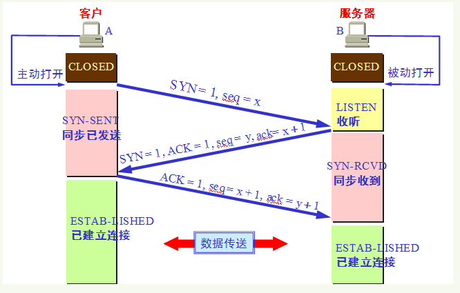
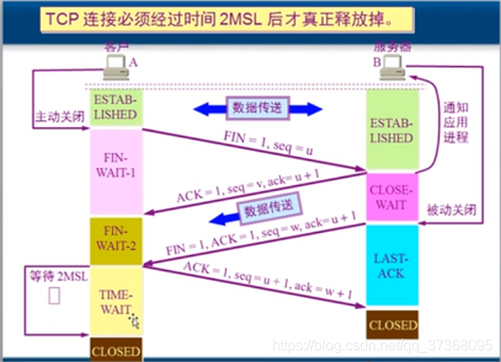
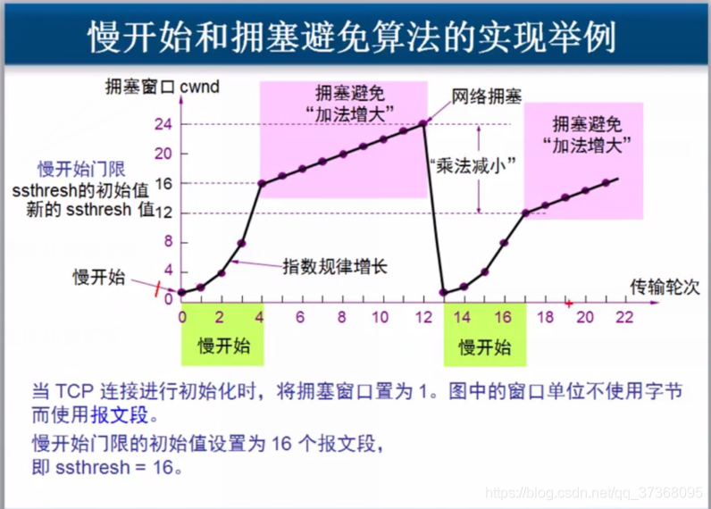
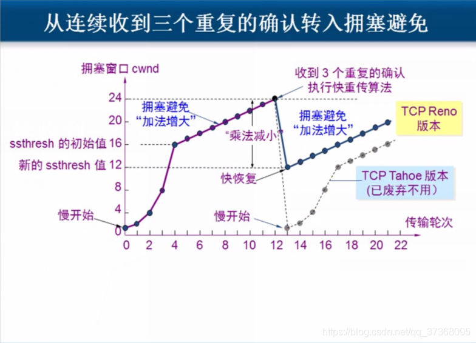
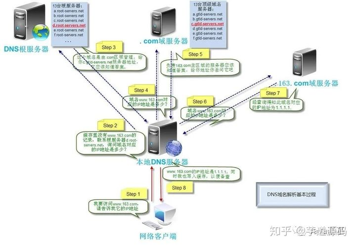

# TCP协议

## TCP、UDP的区别

| 区别 | 特点                       | 传输效率 | 需要资源 | 应用场景                                    |
| ---- | :------------------------- | -------- | -------- | ------------------------------------------- |
| TCP  | 面向连接、可靠、字节流     | 慢       | 多       | 对效率要求低，对准确性要求高，如邮件传输    |
| UDP  | 无连接、不可靠、数据报文段 | 快       | 少       | 对效率要求高，对准确性要求低，如DNS域名解析 |

## 三次握手过程

- 客户端–发送带有 SYN 标志的数据包–一次握手–服务端
- 服务端–发送带有 SYN/ACK 标志的数据包–二次握手–客户端
- 客户端–发送带有带有 ACK 标志的数据包–三次握手–服务端

### 为什么要三次握手

**三次握手最主要的目的就是双方确认自己与对方的发送与接收是正常的。**

三次握手而不是两次，主要防止已经失效的连接请求报文突然又传送到了服务器，从而产生错误。
**在两次握手的情况下**：Client 发送了第一个请求连接并且没有丢失，只是在网络中滞留时间太长。这时，由于 Client 迟迟没能收到 Server 的确认，以为 Server 没有收到，于是又发了一个建立连接的请求并完成了两次握手，传输数据，然后关闭连接。然而这时第一个请求到达了 Server 端，由于两次握手的机制，Server 端立即建立起连接，这将导致不必要的错误和资源浪费。
**三次握手的情况下**：就算第一次的请求到达 Server，Server 发送 SYN 和 ACK 并不能使 Client 回复确认，由于 Server 收不到确认，就知道 Client 并没有请求连接。

### SYN 洪泛攻击

Server 端的资源是在完成第二次握手时分配的，而 Client 端的资源是完成第三次握手时分配的，这就使得服务器易于受到 SYN 洪泛攻击。

SYN洪泛攻击：就是 Client 在短时间内伪造大量不存在的 IP 地址，并向 Server 不断地发送 SYN 包，Server 则回复确认包，并等待 Client 确认，由于源地址不存在，因此 Server 需要不断重发直至超时，这些伪造的 SYN 包将长时间占用未连接队列，导致正常的 SYN 请求因为队列满而被丢弃，从而引起网络拥塞甚至系统瘫痪。这其实是TCP的一个缺点。

## 四次挥手

- 客户端-发送一个 FIN，用来关闭客户端到服务器的数据传送
- 服务器-收到这个 FIN，它发回一 个 ACK，确认序号为收到的序号加 1 。和 SYN 一样，一个 FIN 将占用一个序号
- 服务器-关闭与客户端的连接，发送一个 FIN 给客户端
- 客户端-发回 ACK 报文确认，并将确认序号设置为收到序号加 1

### 为什么要延时等待 2MSL ？

保证Client最后一个发送的ACK报文能够到达Server端，如果中途丢失，Server会超时重传FIN和ACK报文。而Client能在2MSL时间内收到这个重传的报文，接着Client重传一次确认报文ACK，并重启计时器再计时2MSL。如果不等待而直接进入CLOSED状态，那么Server端很有可能就无法正常关闭。

### 为什么不采用 “三次挥手” ？

这个问题与延时等待 2MSL 的回答是一样的！ 

### 为什么建立连接是三次握手，而关闭连接则是四次挥手？

因为服务端在 LISTEN 状态下，收到建立连接请求的 SYN 报文后，把 ACK 和 SYN 放在一个报文里发送给客户端。ACK 报文是用来应答的，SYN 报文是用来同步的。
而关闭连接时，当收到对方的FIN报文时，仅仅表示对方不再发送数据了但还是可以接收数据的，服务端未必在这个时候都把数据发完了，等待数据都发完时再发送 FIN 报文给对方来表示同意关闭连接。因此，服务端一般会把 ACK 和 FIN 分开发送。

## 可靠传输

1. 应用数据被分割成 TCP 认为最适合发送的数据块。
2. TCP 给发送的每一个包进行编号，接收方对数据包进行排序，把**有序**数据传送给应用层。
3. **校验和：** TCP 将保持它首部和数据的检验和。这是一个端到端的检验和，目的是检测数据在传输过程中的任何变化。如果收到段的检验和有差错，TCP 将丢弃这个报文段和不确认收到此报文段。
4. TCP 的接收端会丢弃重复的数据。
5. **流量控制：** TCP 连接的每一方都有固定大小的缓冲空间，TCP 的接收端只允许发送端发送接收端缓冲区能接纳的数据。当接收方来不及处理发送方的数据，能提示发送方降低发送的速率，防止包丢失。TCP 使用的流量控制协议是可变大小的滑动窗口协议。 （TCP 利用滑动窗口实现流量控制）**端到端。**
6. **拥塞控制：** 当网络拥塞时，减少数据的发送。**全局网络范围。**
7. **ARQ 协议：** 也是为了实现可靠传输的，它的基本原理就是每发完一个分组就停止发送，等待对方确认。在收到确认后再发下一个分组。
8. **超时重传：** 当 TCP 发出一个段后，它启动一个定时器，等待目的端确认收到这个报文段。如果不能及时收到一个确认，将重发这个报文段。

## 拥塞控制

### 慢开始和拥塞避免

### 快重传和快恢复

如果收到一个不按顺序的数据段，它会立即给发送方发送一个重复确认（冗余ACK），如果发送发连续收到三个重复确认，它会假定确认件指出的数据段丢失了，并重传一份。

当有单独的数据包丢失时，快速重传和恢复（FRR）能最有效地工作。当有多个数据信息包在某一段很短的时间内丢失时，它则不能很有效地工作。

## 浏览器访问url的过程

- 浏览器查找域名的 IP 地址。
  查找过程：浏览器缓存 > 本地DNS服务器 >  DNS根服务器 > .com服务器等
- 浏览器向 web 服务器发送一个 HTTP 请求。
  - 如果使用了 TCP 协议，就会先进行 TCP 三次握手建立连接。
  - 如果使用了 https 协议，就需要进行加密传输。
- 服务器处理请求，返回结果。

### 用到的协议

- DNS：获取 IP 地址
- TCP：与服务器建立连接
- IP：发送数据在网络层使用 IP 协议
- ARP：IP 地址转化为 MAC 地址
- HTTP：使用 http 协议访问网页
- SSL：使用 SSL 协议对数据进行加密

## DNS 解析域名过程

